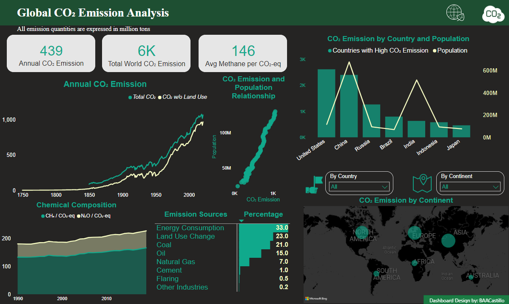

<h2>Global CO2 Emission Project</h2>

**Technologies Used**

Data Cleaning and Exploratory Data Analysis

Data Visualization and Metrics Calculation

<h2>Introduction</h2>

Climate change had become a major environmental concern over time as environmental scientists
observed anomalous behavioral patterns throughout the environment. One of those factor they suspect as a probable cause is the accumulation of carbon dioxide in the atmosphere. CO₂ is described to have high longevity in the atmosphere because of its chemical properties which blankets the Earth's emitted infrared
radiation. Without further discussing about the chemistry of CO₂, this project presents a dataset collected
throughout time (1750 up to 2021) on different parts of the world (232 countries). As a data analyst, we
are to investigate the following <b>objectives</b>:

<ul>
<li>What is the trend of CO₂ emissions in the world over time?</li>
<li>In these observed trends on emission, can it be related to the demographics? </li>
<li>Which country contributes the most emissions? </li>
<li>What is the major chemical constituent of CO₂ gases in the atmosphere? </li>
<li>What are the major sources of these emissions? </li>
</ul>

<h2>Data Manipulation by Pandas Library</h2>

The dataset was recovered from the Maven Analytics public dataset, and initially it
is composed of 50,000 rows by 79 columns. It is a large dataset that requires cleaning, and reducing this
dimension was based on the objectives I formulated.

<h2>Power BI Dashboard</h2>

